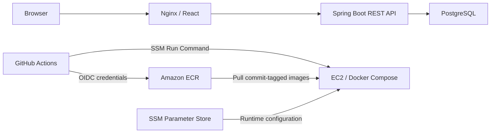

# Gather Todo

A full-stack task workspace built with **React, Spring Boot and PostgreSQL**. Users manage their own projects and tasks, with authentication, server-side filtering and persistent storage.

This repository contains the frontend, REST API, database migrations, automated tests, Docker configuration and AWS deployment pipeline. This README describes the whole application, including Spring Boot assembly, local development and deployment.

## Contents

- [Features](#features)
- [Architecture](#architecture)
- [Run the full stack locally](#run-the-full-stack-locally)
- [Develop without Docker](#develop-without-docker)
- [Spring Boot build and assembly](#spring-boot-build-and-assembly)
- [Configuration](#configuration)
- [Database and migrations](#database-and-migrations)
- [REST API](#rest-api)
- [Verification](#verification)
- [Security behavior](#security-behavior)
- [Docker packaging](#docker-packaging)
- [AWS deployment and lab results](#aws-deployment-and-lab-results)
- [Troubleshooting](#troubleshooting)
- [Repository layout](#repository-layout)
- [Scope and future work](#scope-and-future-work)

## Features

- Registration, login, logout and profile editing.
- Private projects and tasks with ownership checks on the backend.
- Task descriptions, priorities, due dates and completion status.
- A dedicated Completed view; unfinished tasks stay in All tasks and project views.
- Search and priority filters, pagination and sorting.
- Administrator account management: search, edit details, reset passwords and delete users with their workspace.
- Flyway database migrations and JPA schema validation.
- Short-lived JWT access tokens and rotating refresh sessions.
- Docker Compose development stack and GitHub Actions verification/deployment.

Task priorities are `LOW`, `MEDIUM` and `HIGH`. Completing a task moves it to **Completed**; unchecking it there restores it to its original project. Deleting a project removes its active and completed tasks in the same transaction. Resource operations belonging to another user return `404`, including ordinary workspace requests made by an administrator. The frontend includes project navigation, All tasks, Completed and responsive layouts.

### Administrator account

The initial local account is **`admin@qq.com` / `admin`**. Sign in normally, then open **Manage users** in the sidebar. The administrator can also use their own projects and tasks. Account editing supports display name, email and an optional new password. Deleting a user removes their projects, tasks and refresh sessions. Administrator accounts cannot be deleted, and their email cannot be changed through the account editor.

[`AdminBootstrap.java`](backend/src/main/java/com/windy/todo/AdminBootstrap.java) creates this account once, storing a BCrypt hash. [`application.properties`](backend/src/main/resources/application.properties) supplies defaults through `ADMIN_EMAIL` and `ADMIN_PASSWORD`; an existing administrator's password is never overwritten on restart. An existing ordinary account at the configured email causes startup to fail rather than silently granting it administrator rights. Public registration reserves that email and always creates a `USER`.

For deployment, set `ADMIN_PASSWORD` explicitly in the runtime configuration; EC2 Compose requires it. Changing this variable after the account exists does not reset its password: use Manage users to set a new one.

## Architecture



Locally, PostgreSQL runs in Compose. The AWS lab first used PostgreSQL on EC2, then switched the same application image to a private RDS database. Browser access to EC2 used an SSM port-forwarding session; the lab did not expose an HTTP or SSH ingress port.

Nginx serves React assets and proxies `/api` to Spring Boot. The backend JAR contains the REST API and its dependencies. Frontend assets are assembled separately and served by the frontend container; the backend JAR does not bundle the React build. Vite provides the API proxy during development.

| Component | Technology |
| --- | --- |
| Backend | Java 21, Spring Boot 4.1.1, Spring Security, Spring Data JPA, Flyway |
| Frontend | React 19, Vite 8 |
| Build tools | Maven Wrapper / Spring Boot Maven Plugin; Node.js 24 / npm |
| Database | PostgreSQL 17 in Compose and integration tests; H2 for local convenience and selected tests |
| Verification | JUnit, MockMvc, Testcontainers, Vitest, Playwright, container smoke checks |
| AWS lab | EC2, ECR, IAM OIDC, Systems Manager, Parameter Store, RDS |

### Spring Boot application wiring

[`TodoApplication`](backend/src/main/java/com/windy/todo/TodoApplication.java) is the entry point. `@SpringBootApplication` enables application configuration, component scanning and auto-configuration. Spring creates controllers, services and repository implementations and wires their dependencies through constructors. [`SecurityConfig`](backend/src/main/java/com/windy/todo/SecurityConfig.java) explicitly defines the security filter chain, password encoder and JWT beans. See the [Spring Boot annotation documentation](https://docs.spring.io/spring-boot/reference/using/using-the-springbootapplication-annotation.html).

| Layer | Responsibility | Main files |
| --- | --- | --- |
| Controllers | HTTP routes, request validation and authenticated identity | `AuthController`, `TaskController` |
| Services | Transactions, authentication, ownership checks and filtering | `AuthService`, `TaskService` |
| Repositories | Database queries and persistence | `UserRepository`, `ProjectRepository`, `TaskRepository`, `RefreshRepository` |
| Entities | Users, projects, tasks and refresh sessions | `AppUser`, `Project`, `TodoTask`, `RefreshSession` |
| API models | Request/response shapes and field constraints | `ApiModels`, `TaskResponse` |
| Error handling | Validation details and conflict responses | `ApiErrors` |

[`frontend/src/api.js`](frontend/src/api.js) centralizes access tokens, CSRF headers, refresh handling and API errors. [`App.jsx`](frontend/src/App.jsx) provides the workspace UI and hash-based navigation.

## Run the full stack locally

Install Docker with Compose and Node.js 24. Node is used below to generate secrets; Java/Maven do not need to be installed on the host for the container build. Run the following from the repository root in PowerShell:

```powershell
Copy-Item .env.example .env
```

Generate two independent secrets by running this command twice:

```powershell
node -e "console.log(require('node:crypto').randomBytes(32).toString('hex'))"
```

Replace the example `DB_PASSWORD` and `JWT_SECRET` values in `.env` with those secrets. Keep `COOKIE_SECURE=false` for local HTTP access. The `.env` file is ignored by Git.

```powershell
docker compose up --build -d --wait --wait-timeout 180
```

Open **http://localhost:8088/** and register an account. Health is available at **http://localhost:8088/healthz** and the backend version at **http://localhost:8088/api/version**.

```powershell
docker compose logs --tail 100 backend
docker compose down
```

The normal `down` command preserves the PostgreSQL volume. Changing `DB_PASSWORD` does not change the password of a database already initialized in that volume. `docker compose down --volumes` deletes local database data and is only appropriate when intentionally resetting it.

## Develop without Docker

Install Java 21 and Node.js 24. Start the backend in one PowerShell terminal:

```powershell
Set-Location backend
.\mvnw.cmd spring-boot:run "-Dspring-boot.run.profiles=local"
```

Start the frontend in another terminal, from the repository root:

```powershell
Set-Location frontend
npm ci
npm run dev
```

Open **http://localhost:5173/**. Vite proxies `/api` to the backend on port 8080. The `local` profile uses a file-backed H2 database, a development signing key and HTTP cookies. Deployment uses the default PostgreSQL configuration.

The local H2 console is at **http://localhost:8080/h2-console/**. When starting the backend from `backend/`, use JDBC URL `jdbc:h2:file:./.local/todo`, user `sa` and a blank password. The console is enabled only in the local profile.

For a frontend development server targeting another backend, set `API_TARGET` before starting Vite; the default is `http://localhost:8080`.

## Spring Boot build and assembly

This project uses **Maven**, configured in [`backend/pom.xml`](backend/pom.xml). Spring Boot's Gradle plugin has an `assemble` task that depends on `bootJar`. This repository has no Gradle wrapper or `assemble` task; its corresponding build/assembly commands are Maven `package` and `verify`. See [Spring Boot Gradle packaging](https://docs.spring.io/spring-boot/gradle-plugin/packaging.html).

### Assemble the executable JAR

From the repository root in PowerShell:

```powershell
Set-Location backend
.\mvnw.cmd -B -ntp clean package
```

This compiles the application, runs the standard backend tests and creates **`backend/target/todo.jar`**.

The `spring-boot-starter-parent` configures the Spring Boot Maven Plugin's `repackage` execution. Packaging includes application classes under `BOOT-INF/classes`, dependencies under `BOOT-INF/lib` and the Spring Boot launcher. `<finalName>todo</finalName>` supplies the stable output filename. See [Spring Boot Maven packaging](https://docs.spring.io/spring-boot/maven-plugin/packaging.html).

| Goal | Command from `backend/` | Result |
| --- | --- | --- |
| Compile | `.\mvnw.cmd compile` | Compile application classes |
| Standard tests | `.\mvnw.cmd test` | Run the standard backend tests |
| Tested JAR build | `.\mvnw.cmd clean package` | Standard tests and executable `target/todo.jar` |
| Assembly without executing tests | `.\mvnw.cmd clean package -DskipTests` | Executable JAR; no executed-test assurance |
| CI-equivalent backend verification | `.\mvnw.cmd clean verify -Ppostgres-it` | Standard tests, JAR packaging and PostgreSQL integration tests; Docker required |

Maven executes preceding lifecycle phases when `package` or `verify` is selected. The `postgres-it` profile binds Maven Failsafe to `integration-test` and `verify`; **`package` alone does not execute the PostgreSQL integration suite**. See the [Maven lifecycle](https://maven.apache.org/guides/introduction/introduction-to-the-lifecycle.html).

On Linux/macOS, use `./mvnw` instead of `.\mvnw.cmd`. If necessary, make the wrapper executable with `chmod +x mvnw`.

### Run the assembled JAR

While still in `backend/`, run with the local H2 configuration:

```powershell
java -jar target/todo.jar --spring.profiles.active=local
```

The API starts on port 8080. Start Vite separately for the frontend. For PostgreSQL, omit the local profile and supply the database/signing settings below. Building a JAR does not provision a database.

### Build the frontend artifact

From the repository root in another terminal:

```powershell
Set-Location frontend
npm ci
npm run build
```

The output is **`frontend/dist/`**. The frontend Docker build copies it into Nginx and adds `version.json` using its `APP_VERSION` build argument.

## Configuration

The default backend profile uses PostgreSQL:

| Variable | Purpose / default |
| --- | --- |
| `DB_URL` | JDBC URL; backend default `jdbc:postgresql://localhost:5432/todo` |
| `DB_USER` | Database role; backend default `todo` |
| `DB_PASSWORD` | Database password; required for the PostgreSQL configuration |
| `JWT_SECRET` | Stable signing secret with at least 32 UTF-8 bytes |
| `COOKIE_SECURE` | Defaults to `true`; local HTTP/SSM-tunnel lab uses `false` |
| `ALLOWED_ORIGINS` | Comma-separated origins; backend default `http://localhost:5173` |
| `APP_VERSION` | Backend release identifier; defaults to `local` |
| `ADMIN_EMAIL` | Bootstrap administrator email; defaults to `admin@qq.com` |
| `ADMIN_PASSWORD` | Initial administrator password; local default `admin`, required explicitly by EC2 Compose |

Root Compose sets `DB_URL=jdbc:postgresql://postgres:5432/todo` so the backend reaches the database by its service name. EC2 Compose reads its runtime environment file and sets the browser origin to `http://localhost:8088`.

The root `.env` is consumed by Docker Compose. Maven and `java -jar` **do not automatically import it**; use the local profile or export environment variables explicitly for a standalone PostgreSQL backend.

[`application-local.properties`](backend/src/main/resources/application-local.properties) supplies local H2 settings. [`application-test.properties`](backend/src/test/resources/application-test.properties) supplies isolated test settings. Runtime secrets and local environment files are ignored by Git.

## Database and migrations

[`V1__accounts_projects_tasks.sql`](backend/src/main/resources/db/migration/V1__accounts_projects_tasks.sql) creates the schema:

| Table | Purpose |
| --- | --- |
| `app_users` | Unique email, BCrypt password hash, display name, role and token version |
| `projects` | Name, owner and creation timestamp |
| `tasks` | Project association, content, priority, due date, completion and timestamps |
| `refresh_sessions` | Token hash, user, session family, expiry and revocation state |
| `flyway_schema_history` | Migration history maintained by Flyway |

Relationships are **user → projects → tasks** and **user → refresh sessions**. Foreign keys enforce associations; indexes support ownership, task filtering and refresh-family queries.

[`V2__admin_accounts.sql`](backend/src/main/resources/db/migration/V2__admin_accounts.sql) adds `role` (`USER`/`ADMIN`) and `token_version`. Existing accounts retain their data and become `USER` with token version zero. Project/user deletion uses ordered bulk deletes inside a service transaction, preserving foreign-key integrity.

Flyway migrates the database during startup, then Hibernate validates entity/schema compatibility through `spring.jpa.hibernate.ddl-auto=validate`. Add new versioned migrations for future schema changes rather than modifying applied ones. Local Compose stores PostgreSQL data in a named volume; the EC2 configuration uses `todo_postgres_data`.

## REST API

Base path: `/api`. JSON bodies use camelCase. Protected routes require a bearer token. Cookie-based authentication mutations require CSRF protection; Spring Security exempts requests carrying a Bearer token. The browser client sends CSRF headers on every mutation.

| Method | Endpoint | Purpose |
| --- | --- | --- |
| GET | `/auth/csrf` | Obtain a CSRF token |
| POST | `/auth/register` | Register and start a session |
| POST | `/auth/login` | Log in |
| POST | `/auth/refresh` | Rotate a refresh session |
| POST | `/auth/logout` | Revoke the refresh session |
| GET / PUT | `/me` | Read/update the current profile |
| GET / POST | `/projects` | List/create projects |
| PUT / DELETE | `/projects/{id}` | Rename/delete a project |
| GET | `/tasks` | List tasks across the user's projects |
| GET / POST | `/projects/{projectId}/tasks` | List/create tasks in a project |
| GET / PUT / DELETE | `/tasks/{id}` | Read/update/delete a task |
| GET | `/admin/users` | Administrator-only user search; `q`, `page`, `size` |
| PUT / DELETE | `/admin/users/{id}` | Administrator-only edit/password reset or account/workspace deletion |
| GET | `/version` | Read the backend release identifier |

Registration body:

```json
{
  "email": "demo@example.com",
  "password": "example-password-for-documentation",
  "displayName": "Demo"
}
```

Task creation/update body:

```json
{
  "title": "Review the deployment",
  "description": "Check health and version endpoints",
  "priority": "HIGH",
  "dueDate": "2026-10-15",
  "completed": false
}
```

Task-list parameters:

| Parameter | Accepted values / behavior |
| --- | --- |
| `q` | Search title/description; maximum 200 characters |
| `completed` | `true` selects completed tasks; `false` or omission selects unfinished tasks |
| `priority` | `LOW`, `MEDIUM`, `HIGH` |
| `page` | Zero-based index; default `0` |
| `size` | `1`–`100`; default `10` |
| `sort` | `createdAt`, `updatedAt`, `dueDate`, `title`; default `createdAt` |
| `direction` | `asc` or `desc`; default `desc` |

Example: `/api/tasks?q=deployment&completed=false&priority=HIGH&page=0&size=10&sort=dueDate&direction=asc`.

Paginated responses include `content`, `page`, `size`, `totalElements` and `totalPages`. Validation failures include field errors. Common status codes are `400` for invalid input, `401` for authentication failure, `403` for invalid/missing CSRF, `404` for unavailable resources and `409` for conflicts.

The backend health endpoint is `/actuator/health`; Nginx exposes it as `/healthz`.

## Verification

Backend checks, including the PostgreSQL Testcontainers suite, require Java 21 and a running Docker engine:

```powershell
Set-Location backend
.\mvnw.cmd -B -ntp verify -Ppostgres-it
```

From the repository root, frontend checks are:

```powershell
Set-Location frontend
npm ci
npm test
npm run build
npx playwright install chromium
npm run test:e2e
```

The backend `verify` command builds `backend/target/todo.jar`, which Playwright needs. Playwright starts its own H2-backed backend and Vite server on ports 18080 and 15173. On Linux, browser installation can require `npx playwright install --with-deps chromium`.

Tests cover authentication, refresh-token rotation/reuse, CSRF, ownership isolation, completed-task movement/restoration, project cleanup, administrator permissions and account/session cleanup. Browser workflows exercise these behaviors and mobile layouts. CI also builds and smoke-tests the actual Compose stack before publishing images.

| Test | Coverage |
| --- | --- |
| `ApiIntegrationTest` | API validation, authentication, profiles, CRUD, completed views, cleanup, admin access, ownership and sessions |
| `AccountMigrationTest` | Upgrade a V1 database while preserving an existing account |
| `AdminBootstrapTest` | Preserve existing admin credentials; refuse to promote an existing ordinary user |
| `PostgresIT` | API integration scenarios against PostgreSQL 17 through Testcontainers |
| `H2ConsoleIntegrationTest` | Local console access and separation from API security |
| `TodoApplicationTests` | Application context startup |
| `frontend/src/api.test.js` | Frontend API client |
| `frontend/e2e/workspace.spec.js` | Completed/restored tasks, project cleanup, admin editing/reset/deletion, session behavior and responsive layouts |

## Security behavior

Passwords use BCrypt. Access tokens are kept in frontend memory; refresh tokens are stored in an HttpOnly, SameSite=Strict cookie and their hashes are stored in the database. Refresh-token reuse revokes the associated session family. Cookie-based authentication mutations require a CSRF token; Bearer-authenticated API requests are exempt, although the SPA sends CSRF headers for both.

Access tokens use HS256 with issuer `todo-api`, audience `todo-web` and a **ten-minute** lifetime. Refresh families expire **seven days** after the initial login/registration; rotation does not extend that deadline. Passwords use BCrypt strength **12** and are limited to 72 UTF-8 bytes. Refresh tokens are random values stored as SHA-256 hashes.

The frontend sends `Authorization: Bearer ...` on protected requests and `X-XSRF-TOKEN` on mutations. Refresh cookies are scoped to `/api/auth`. Client refresh operations are serialized, including across tabs when Web Locks is available. Logout revokes the refresh family and clears its cookie; already-issued access JWTs remain valid until expiry.

JWT validation also reads the account from the database and compares the signed `ver` claim with `token_version`. Administrator password resets increment that version and remove refresh sessions; deletion removes the account. Previously issued access/refresh credentials then fail on subsequent requests. Legacy access tokens without `ver` are accepted only while the stored version remains zero. This account lookup means access-token validation depends on database availability.

Administrator endpoints check the current database role in the service layer. Hiding Manage users in the frontend is only presentation: ordinary accounts also receive `403` from the backend, even with a forged role claim in an otherwise valid token. User responses never contain password hashes or session credentials. Administrator account management does not grant access to other users' task APIs.

The API checks resource ownership using the authenticated user identity. The H2 console is available only in the local profile. Nginx applies a rate limit to registration and login.

`COOKIE_SECURE=false` is a local/SSM-tunnel lab setting. Internet deployment requires a trusted HTTPS setup and secure cookies. The lab is a single-instance demonstration; it does not establish high availability or measured production capacity.

## Docker packaging

Both application images use multi-stage builds:

- **Backend:** the Java 21 JDK stage assembles `todo.jar` using Maven. The Java 21 JRE runtime starts it as a non-root user. Packaging in the Dockerfile skips tests; CI executes verification separately before publishing.
- **Frontend:** Node.js 24 builds React assets, then an unprivileged Nginx image serves them and proxies the API.

Both images include health checks. Local Compose waits for PostgreSQL before the backend and for the backend before the frontend. Only the frontend is published to the host at `127.0.0.1:8088`; PostgreSQL and the backend stay on the Compose network.

The EC2 configuration adds a read-only RDS certificate mount and container log rotation. Its `database` profile enables the PostgreSQL container; deployment mode `rds` uses an external database.

## AWS deployment and lab results

The [workflow](.github/workflows/ci-cd.yml) verifies pull requests and pushes. Image publishing and deployment require a **push to `main`** and the repository variable `AWS_DEPLOY_ENABLED=true`. A manual workflow dispatch runs verification only. Keep deployment disabled after cloud cleanup.

Images use immutable full commit-SHA tags. Deployment retrieves runtime configuration from SSM SecureString `/todo/lab/env`, updates the frontend/backend pair, checks health and matches their version endpoints. Runtime secrets are not stored in GitHub repository variables.

| GitHub variable | Purpose |
| --- | --- |
| `AWS_DEPLOY_ENABLED` | Deployment gate: `true` or `false` |
| `AWS_REGION` | Deployment region; `us-east-2` in the lab |
| `AWS_ROLE_ARN` | GitHub OIDC publishing/deployment role |
| `ECR_REGISTRY` | Registry host |
| `EC2_INSTANCE_ID` | Managed target instance |
| `DB_MODE` | `database` or `rds`; defaults to `database` |

The GitHub role trusts the repository's actual OIDC subject and STS audience. EC2 uses its own role for SSM management, image pulls and runtime-parameter access. Release files are stored at `/opt/todo/releases/<sha>`; `/opt/todo/current` is updated after successful health/version checks. An EC2 lock and workflow concurrency avoid overlapping releases.

The deployment script attempts an application-image rollback when a different previous release is available. Reconfiguring the same release does not provide an automatic configuration rollback; database data and migrations are not reverted by changing an image tag.

### RDS setup and result

The RDS exercise used a private database in the application's VPC, with PostgreSQL access allowed from the EC2 application security group. Role `todo_app` had `CONNECT` on `todo` and `USAGE, CREATE` on `public`, allowing startup Flyway migrations.

RDS runtime settings take this form:

```dotenv
DB_USER=todo_app
DB_PASSWORD=<application-role-password>
DB_URL=jdbc:postgresql://<rds-endpoint>:5432/todo?sslmode=verify-full&sslrootcert=/certs/global-bundle.pem
JWT_SECRET=<existing-signing-secret>
COOKIE_SECURE=false
ADMIN_EMAIL=admin@qq.com
ADMIN_PASSWORD=<initial-administrator-password>
```

The CA bundle is mounted read-only from `/opt/todo/certs` to `/certs`. Preserve the JWT signing key when changing database settings. Mode `rds` does not automatically stop an already-running local PostgreSQL container.

The exercise verified TLS connectivity, successful Flyway migration, a UI-created task appearing directly in RDS and healthy application containers after stopping the old PostgreSQL container. The final checked release was `5937f651ba95a9561550a7912296c657d45db946`. This was a fresh database exercise, not a migration of existing users/tasks.

The lab used console/CLI provisioning. [`deploy/infrastructure.yml`](deploy/infrastructure.yml) is an included infrastructure template; this record does not claim it was validated as a deployed CloudFormation stack.

See [the AWS lab record](docs/aws-lab.md) for the RDS connection checks, configuration incident and cleanup checklist. The lab verified PostgreSQL **18.3** on RDS manually; the automated PostgreSQL integration suite currently targets **17**.

## Troubleshooting

| Symptom | What to check |
| --- | --- |
| Backend cannot start | Inspect `docker compose logs --tail 100 backend`; confirm database settings and migrations |
| Container connects to `localhost:5432` | Check `DB_URL`: Compose uses `postgres`, RDS needs its actual endpoint. `localhost` refers to the backend container |
| RDS URL contains `//:5432` | The host variable was empty; verify the endpoint before saving configuration |
| Password fails after editing `.env` | An existing PostgreSQL volume retains its initialized password; change the database password explicitly or intentionally reset disposable data |
| Cookie authentication fails on HTTP | Local HTTP needs `COOKIE_SECURE=false`; secure public deployment needs HTTPS |
| Mutation returns `403` | Obtain a current CSRF token and send its header with the associated cookie |
| Playwright cannot start the backend | Build `backend/target/todo.jar`, install Chromium and free ports 18080/15173 |
| AWS deployment job is skipped | Check a push to `main`, `AWS_DEPLOY_ENABLED=true` and repository variables |
| OIDC role assumption fails | Check the identity provider, STS audience and exact trusted subject claim |
| AWS CLI session expired | Reauthenticate the intended profile using `aws login --profile <profile>` |

## Repository layout

```text
backend/
  pom.xml                         Maven dependencies, packaging and integration-test profile
  mvnw / mvnw.cmd                  Maven Wrapper
  src/main/java/com/windy/todo/    API, services, repositories, entities and security
  src/main/resources/             Spring properties and Flyway migrations
  src/test/                       Backend tests and test configuration
frontend/
  src/                            React UI, API client, styles and unit tests
  e2e/                            Playwright browser tests
  nginx.conf                      Production frontend/API proxy
  Dockerfile                      Frontend image build
deploy/
  compose.ec2.yml                  EC2 application stack
  deploy.sh                       Health-checked release deployment
  make-ssm-command.py              SSM payload generator
  wait-ssm.sh                      Deployment completion checks
  infrastructure.yml              Infrastructure template
  .env.ec2.example                Runtime parameter example
.github/workflows/                 Verification, deployment and OIDC diagnostic workflows
docs/aws-lab.md                    Historical lab evidence and cleanup checklist
.env.example                       Local configuration example
compose.yml                        Local full-stack configuration
README.md                          Overall project documentation
```

## Scope and future work

The application demonstrates private task management and a verified single-instance deployment path. Shared projects, notifications, password recovery, high availability and measured load capacity are not implemented. The RDS lab uses one role for both migrations and application queries; a production setup can separate those privileges.

Potential next steps include aligning CI PostgreSQL coverage with the RDS major version, adding trusted public HTTPS, separating migration/runtime roles and measuring performance before making capacity claims.

The temporary AWS experiment has ended; there is no maintained public demo. Cleanup covers the lab database, instance, storage, images, secrets and dedicated permissions, including retained backups/snapshots where applicable. Keep `AWS_DEPLOY_ENABLED=false` until deliberately provisioning another deployment. Local development and the full Docker stack remain available.
